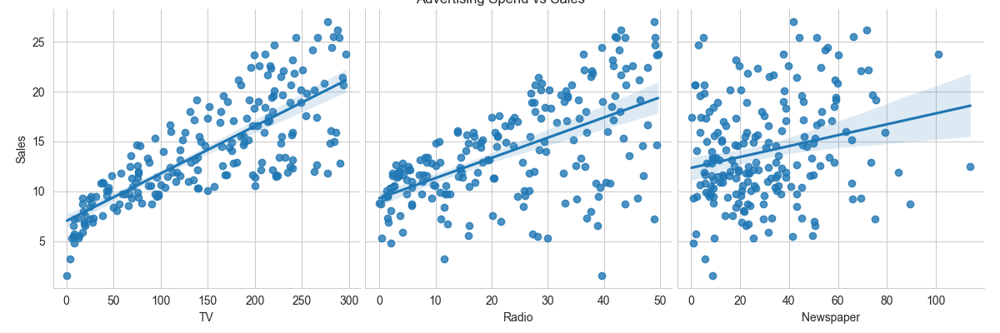
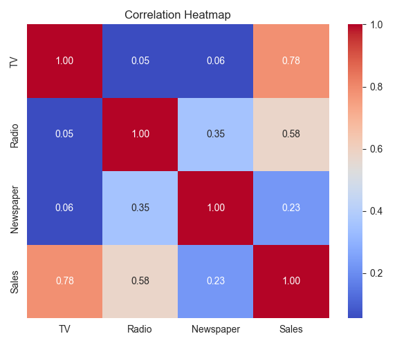
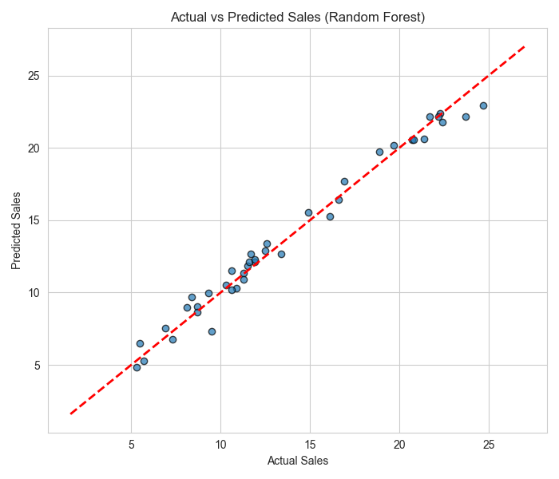

# Sales Prediction using Advertising Data 📈

A Python project that predicts product sales based on advertising spend across TV, Radio, and Newspaper channels using regression models.

## 📁 Dataset
- `Advertising.csv` – 200 records of advertising budgets (in thousands of dollars) for TV, Radio, and Newspaper, along with resulting Sales (in thousands of units)

## 🛠️ Tech Stack
- Python
- Pandas, NumPy
- Matplotlib, Seaborn
- Scikit-learn

## ⚙️ How to Run
```bash
pip install pandas numpy matplotlib seaborn scikit-learn
python sales_prediction.py
```

## 🔍 Approach
1. Load and clean the advertising dataset
2. Explore correlations between each ad channel and Sales
3. Train and compare 3 regression models:
   - Linear Regression
   - Decision Tree Regressor
   - Random Forest Regressor
4. Evaluate using RMSE, MAE, and R² Score
5. Visualize actual vs predicted sales for the best model

## 📈 Key Insights
Dataset shape: (200, 4)

First 5 rows:
       TV  Radio  Newspaper  Sales
0  230.1   37.8       69.2   22.1
1   44.5   39.3       45.1   10.4
2   17.2   45.9       69.3    9.3
3  151.5   41.3       58.5   18.5
4  180.8   10.8       58.4   12.9

Summary statistics:
                TV       Radio   Newspaper       Sales
count  200.000000  200.000000  200.000000  200.000000
mean   147.042500   23.264000   30.554000   14.022500
std     85.854236   14.846809   21.778621    5.217457
min      0.700000    0.000000    0.300000    1.600000
25%     74.375000    9.975000   12.750000   10.375000
50%    149.750000   22.900000   25.750000   12.900000
75%    218.825000   36.525000   45.100000   17.400000
max    296.400000   49.600000  114.000000   27.000000

Missing values:
 TV           0
Radio        0
Newspaper    0
Sales        0
dtype: int64

Correlation with Sales:
 Sales        1.000000
TV           0.782224
Radio        0.576223
Newspaper    0.228299
Name: Sales, dtype: float64

=======================================================
MODEL COMPARISON
=======================================================
Linear Regression  | RMSE:  1.782 | MAE:  1.461 | R2 Score:  0.899
Decision Tree      | RMSE:  1.475 | MAE:  0.985 | R2 Score:  0.931
Random Forest      | RMSE:  0.769 | MAE:  0.620 | R2 Score:  0.981

=======================================================
BEST MODEL: Random Forest
=======================================================

Saved charts: ad_spend_vs_sales.png, correlation_heatmap.png, actual_vs_predicted.png

Predicted Sales for TV=150, Radio=25, Newspaper=10 budget: 15.22 units


## 📊 Visualizations

### Advertising Spend vs Sales


### Correlation Heatmap


### Actual vs Predicted Sales (Random Forest)


## 👤 Author
Your Name Here
